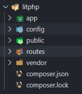
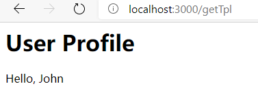

用composer一步一步创建一个简单的PHP MVC 框架

## 框架litphp

由little + php 组成，意思为：极致简单php框架。取 little 的前3个字母+php组成 litphp。利用现有组件组合而成的框架。

## 新建框架litphp
新建目录 litphp

### 添加路由组件
在litphp文件夹里新建 composer.json 文件， 

打开文件composer.json，写上如下内容：
```json
{
    "name": "jiujuan/litphp",
    "description": "name:little+php, a php framework",
    "require": {
        "nikic/fast-route": "*"
    }
}
```
下载路由组件fastroute，执行命令：`composer update`，
下载 fast-route 组件，执行成功后，新建相关目录

### 新建相关目录
新建 app，public，routes，config 目录，如下图：


- app：应用目录
- public：入口目录
- routes：路由目录
- config：配置目录

#### 入口文件
在public下面新建入口文件 index.php，然后编写如下代码：
```PHP
<?php
define('ROOTPATH', str_replace('public', '', __DIR__));
echo ROOTPATH;
// autoload 自动加载
require ROOTPATH . '/vendor/autoload.php';
require ROOTPATH . '/routes/router.php';
```

#### 路由文件
在 routes 下新建 router.php 文件，代码如下：
```php
<?php
use FastRoute\RouteCollector;
$routes = FastRoute\simpleDispatcher(function (RouteCollector $r) {
    $r->get("/hello", function () {
        echo "hello world";
    });
    $r->addRoute('GET', '/', 'IndexController@Index');
});
```

#### 控制器
router.php 里面有一个路由到控制操作 `IndexController@Index` ，新建一个IndexConterooler.php 控制器文件。
在 app 目录下新建控制器目录controllers。


增加 controller
在 controllers 目录下新建基控制器 BaseController.php, 代码如下：

```php
<?php
namespace app\controllers;
class BaseController
{
}
```

在 controllers 目录下新建 IndexController.php, 代码如下：
```PHP
<?php
namespace app\controllers;
class IndexController extends BaseController
{
    public function Index()  {
        echo "hello , IndexController";
    }
}
```

运行之后，会报错，找不到 IndexController.php 文件，我们在composer.json 里增加如下配置：
```json
"autoload": {
        "classmap": [
            "app/controllers",
            "app/models"
        ]
    }
```
然后，运行命令： `composer dump-autoload`

然后运行命令：php -S 127.0.0.1:3000 -t ./public

在浏览器上运行 http://localhost:3000/

### 添加数据库组件
添加数据库组件，这里使用laravel的Eloquent。
在composer.json里添加："illuminate/database": "*"，然后 命令行敲入，composer update 下载组件

 在public/index.php 引入数据库：
```php
use Illuminate\Database\Capsule\Manager as Capsule;

// 引入Eloquent ORM
$capsule = new Capsule();
$capsule->addConnection(require ROOTPATH . '/config/database.php');
$capsule->bootEloquent();
```

### model文件
 在app文件夹下新建model文件夹。

 在 models下新建文件 Article.php，代码如下：
```php
<?php
namespace app\models;

use Illuminate\Database\Eloquent\Model;

class Article extends Model
{
    public $timestamps = false;
}
```

在controllers\IndexController.php 增加如下代码：
```php
public function getArticle() {
        $article = Article::First();
        print_r($article);
 }
```

在router.php里添加article路由：
添加代码：$r->get("/article", 'IndexController@getArticle');

```php
$dispatcher = FastRoute\simpleDispatcher(function (RouteCollector $r) {
    $r->get("/hello", function () {
        echo "hello world";
    });
    $r->get('/', 'IndexController@Index');
    $r->get("/user/{name}", 'IndexController@Index');
    $r->get("/article", 'IndexController@getArticle');
});
```
当然这里自己建立一个名为blog的数据库，然后建立articles的数据表，添加id，name，age，cretetime ，updatetime字段。增加一条数据。

然后在浏览器上运行程序： http://localhost:3000/article，就会显示Article表的第一行数据。

### 模板
1. 在composer.json 里添加 `"league/plates": "3.3.0"` ，

然后运行命令下载模板：`composer update`

然后在 litphp 目录下新建一个 helpers 目录，在里面新建一个 helpers.php 的辅助全局文件，模板代码就添加到这里面：
```php
<?php
function view() {    
   return new League\Plates\Engine(ROOTPATH.'/views');
}
```

2. 在 litphp 目录下新建 views 目录存放模板文件。用官方的例子 profile.php, template.php
profile.php:
```php
<?php $this->layout('template', ['title' => 'User Profile']) ?>

<h1>User Profile</h1>
<p>Hello, <?=$this->e($name)?></p>
```
tempate.php:
```php
<html>
<head>
    <title><?=$this->e($title)?></title>
</head>
<body>

<?=$this->section('content')?>

</body>
</html>
```

3. 在 app/controllers 下新建 TplDemoController.php 文件：
```php
<?php
namespace app\controllers;

class TplDemoController extends BaseController
{
    public function getTpl() {
        echo view()->render('profile', ['name' =>'John']);
    }
}
```

4. 在 routes/router.php 里添加路由
```php
$r->get("/getTpl", 'TplDemoController@getTpl');
```

5. 然后在浏览器运行：http://localhost:3000/getTpl



